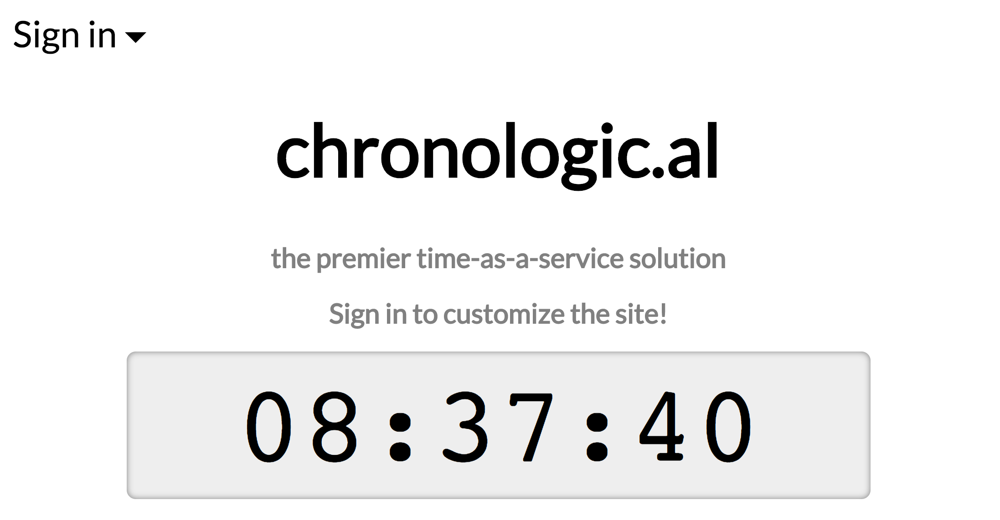

# Chronologic.al: Debugging Practice App

This simple Meteor application is designed to help you practice debugging in
Meteor in a production setting. It's a simple live clock that shows the current
time. Users can log in to customize their timezone and theme color. The app is
build with the `--production` flag to simulate a real debugging situation.

The app is mostly working, but users have reported some problems. Work through
the examples below to practice debugging in Meteor!

## Start the app

1. Install Meteor on your computer from https://www.meteor.com/install
2. Run `npm start` in the root directory of this repo to start the app

## Problem 1: Why is the clock blinking so quickly?

### Problem description:

Users have observed that when they are logged out, the dots on the clock blink
on and off each second, which they love. However, as soon as they log in, the
blinking becomes much more erratic. What's going on here?

### Hint:

The `watchTime` function in `client/time.js` is responsible for updating the
displayed time. Try looking at it in the Chrome debugger!

## Problem 2: Why is the moon phase stuck?

### Problem description:

The clock has a moon phase indicator that shows users the current phase of the
moon. However, some users have called in to say that it seems stuck showing a
new moon (completely hidden) all the time. Why isn't the moon phase changing?

### Hint:

The client calls the meteor method `getMoonPhase` (defined in
`server/methods.js`) to check the current phase of the moon.

Uncomment the line to add `demo:method-enhancements` in `.meteor/packages` to
enable method logging!

Once you see what's going on in the logs, try logging in to the production
Meteor shell to test the function. The `qualia:prod-shell` package created a
script in your home directory to log in to the Meteor shell. In production, this
file would be on your server, accessible via SSH.

Run `node ~/meteor-shell.js` to open the prod Meteor shell.

## Problem 3: What's happening with user preferences?

### Problem description:

Users love that they can adjust their timezones and theme colors for the clock,
but we have heard some reports that the timezone dropdown menu is behaving
weirdly. It often appears blank, and when affected users choose their timezone,
it doesn't seem to "stick".

### Hint:

This one is subtle :) The form inputs for the user's preferences rely on data
published from the server. Check out the subscriptions in the Meteor dev tools,
and the docs at https://docs.meteor.com/api/pubsub.html#Meteor-publish

## Bonus (optional): Run this app in a virtual machine

This app includes an example of using production sourcemaps and the production
meteor shell. `npm start` runs meteor with the `--production` flag to
demonstrate these features, but for even more realism, you can build this app
and run it in a virtual machine.

To try it out, run the following commands in this repo's root directory. You
will need Vagrant and Virtualbox installed on your machine.

    vagrant up
    cd .deploy
    mup setup
    mup deploy

These commands will start an Ubuntu virtual machine and deploy the production
build of this Meteor app into the virtual machine.

Visit the app at `localhost:8080`. When you open the Chrome console, the
"sources" tab should automatically discover the source maps.

If you change the source code, you can redeploy it to the virtual machine by
running `mup deploy` again.

Log in to the virtual machine with `vagrant ssh`, and run
`node ~/meteor-shell.js` to open the production Meteor shell!
